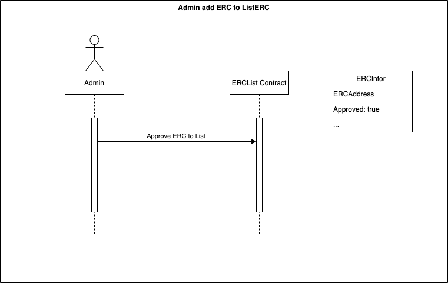

<h1 align="center">Welcome to MOW Market 🐮</h1>

  

## Introduction 👋

The platform allows blockchain users to create, sell or collect NFT

## Live Project 🚀

https://mow-market-275c5.web.app/

## Video demo

## Roadmap ⛳

### 📌 Phase 1:

- [Admin] List NFT contract address -> **BEP-1155**, **BEP-721**
- Login
- Sell NFT with fixed price
- Buy NFT with fixed price
- My page: list all my NFT assets
- Browse page: buy NFT assets
- Create page: create own NFT

### Phase 2:

- Let user create their own NFT assets right on UI
- Implement aution style (bid/ask) NFT market
- Improve UI:
  - Sort NFT by categories
  - Show activity -> transfer, bid, sales, listing
  - Show NFT leaderboard -> volume, avg price

### Phase 3:

- Improve UX by reduce user's approve & sign transactions.
- NFT lending/borrowing/farming.

**Future:**

- Swap NFT between chains (**Ethereum** and **Binance smart chain**)

## Sequence Diagram

- Users create request for new NFT contract address:
  
- Admin accepts listing requests for new NFT contract address:
  
- Users create orders when selling their NFT
  
- Users create transactions to buy the NFTs being offered for sale
  
- The owners of the NFTs can cancel the sell orders if they no longer want to sell
  
- Users can create their own NFT with MOW:
  

## Technical 🤖

- Frontend: Using **Reactjs**, **Redux thunk**

  

- Storage: Using **3Box** (https://github.com/3box/3box) for user's profile, **Sia** for NFT's storage:

  
  

- Smart contract: Using solidity version 0.6.12 and **Upgradable Proxy Contracts**.
